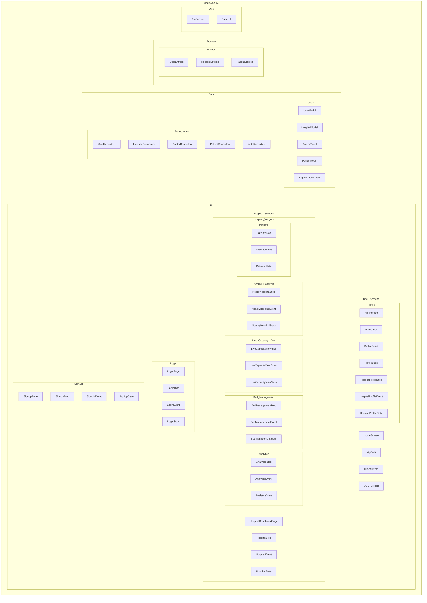

    

    <b>Automatic Architecture Diagrams from Code</b> 
    <a href="https://github.com/swark-io/swark">GitHub</a> • <a href="https://swark.io">Website</a> • <a href="mailto:contact@swark.io">Contact Us</a>

## Usage Instructions

1. **Render the Diagram**: Use the links below to open it in Mermaid Live Editor, or install the [Mermaid Support](https://marketplace.visualstudio.com/items?itemName=bierner.markdown-mermaid) extension.
2. **Recommended Model**: If available for you, use `claude-3.5-sonnet` [language model](vscode://settings/swark.languageModel). It can process more files and generates better diagrams.
3. **Iterate for Best Results**: Language models are non-deterministic. Generate the diagram multiple times and choose the best result.

## Generated Content
**Model**: GPT-4o - [Change Model](vscode://settings/swark.languageModel)  
**Mermaid Live Editor**: [View](https://mermaid.live/view#pako:eNqNVk2PmzAQ_SvI5z1UqtRDbsmy0lbatNHSbC9IyIEJWALbMiYVXe1_r4HY-GvTnGDeG_u9sQebd1SyCtAG5bQWmDfJrzSnSdIPpyXcQ0WykZZfv32ZcIs5fl8AG-pBFFkpAGivySR5Zh0s4Irtxzc8tNIC2i3F7fgXhDUy-5kV_kgjdhDsTFpYmURDB1zH4F3Lygj8dAEqI3gmsbSmAVrpwHo1bp5Zz4nEbVh-mPKbVDXI3tY0SfMqSFI6bLLCfhEWFRRicV4xTg2O_g6qYo-pWsEumE1xKxUaceiIGYe_29ALuUDxiDkuiRyLNwJ_3FknXtMTG_ryMyLW_JS73f0ALE5jobfW27WF1WTozOUjvtyEu10dsCRqLs-NRkMfmok40NT92uFnmZjW_-RLDBIiRryM236cQI9Mcd-cGBaVez7Et-eTTYluRew8eGE1sU6tOXR1Z8gVnSFPccb-K5eRmh65dXLOsSu4YK7ignmSCxjXNC9GOsUSB3726lKxv4bpZpixcCk9OGWlZH7utQs9dMs5I1R2PhNboFfgrCdqZgKeLcOMobcYtxiMMVeXMWo7yCbEb60q6_DaQAZ-opLIoIQQNe0bMFeTPnHDylGSdSu3nGQgLqQ0rbHDPRxF64yeH-gBdSBUGZX6vXjPkWzUyZ-jTZKjCs7z9Y8-VNLAK9VpKcFKrkMbKQZ4QHiQbPrv0LFgQ92gzVmdsfDxDz8TnSE) | [Edit](https://mermaid.live/edit#pako:eNqNVk2PmzAQ_SvI5z1UqtRDbsmy0lbatNHSbC9IyIEJWALbMiYVXe1_r4HY-GvTnGDeG_u9sQebd1SyCtAG5bQWmDfJrzSnSdIPpyXcQ0WykZZfv32ZcIs5fl8AG-pBFFkpAGivySR5Zh0s4Irtxzc8tNIC2i3F7fgXhDUy-5kV_kgjdhDsTFpYmURDB1zH4F3Lygj8dAEqI3gmsbSmAVrpwHo1bp5Zz4nEbVh-mPKbVDXI3tY0SfMqSFI6bLLCfhEWFRRicV4xTg2O_g6qYo-pWsEumE1xKxUaceiIGYe_29ALuUDxiDkuiRyLNwJ_3FknXtMTG_ryMyLW_JS73f0ALE5jobfW27WF1WTozOUjvtyEu10dsCRqLs-NRkMfmok40NT92uFnmZjW_-RLDBIiRryM236cQI9Mcd-cGBaVez7Et-eTTYluRew8eGE1sU6tOXR1Z8gVnSFPccb-K5eRmh65dXLOsSu4YK7ignmSCxjXNC9GOsUSB3726lKxv4bpZpixcCk9OGWlZH7utQs9dMs5I1R2PhNboFfgrCdqZgKeLcOMobcYtxiMMVeXMWo7yCbEb60q6_DaQAZ-opLIoIQQNe0bMFeTPnHDylGSdSu3nGQgLqQ0rbHDPRxF64yeH-gBdSBUGZX6vXjPkWzUyZ-jTZKjCs7z9Y8-VNLAK9VpKcFKrkMbKQZ4QHiQbPrv0LFgQ92gzVmdsfDxDz8TnSE)

